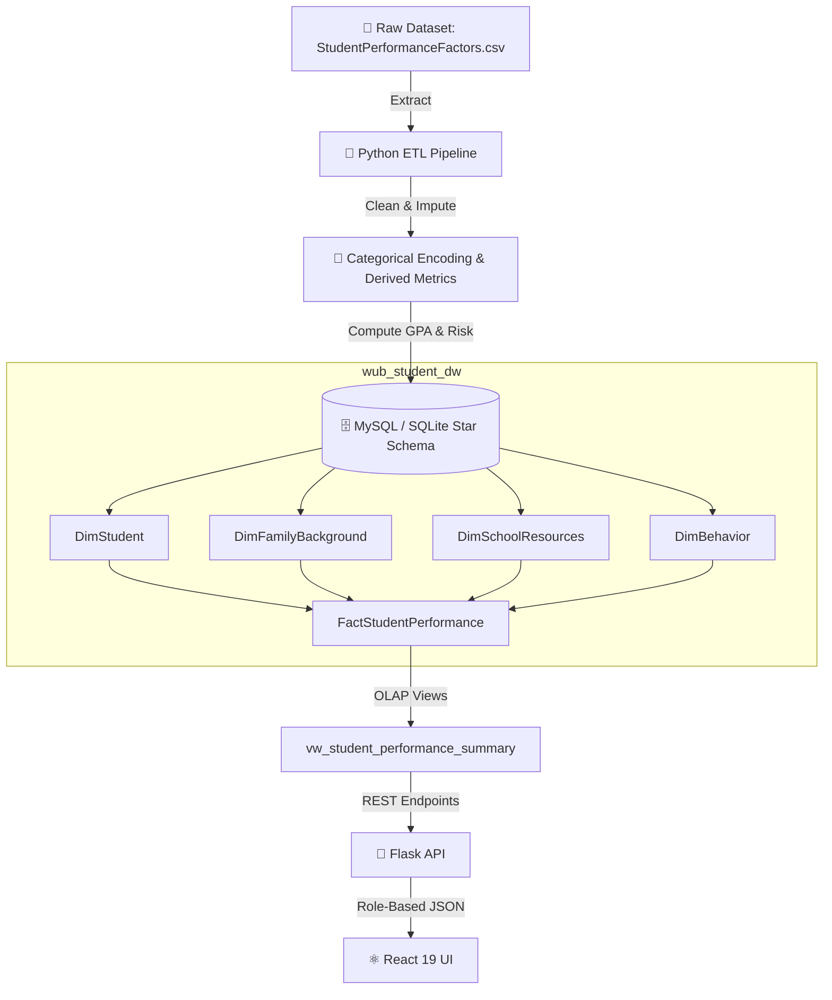
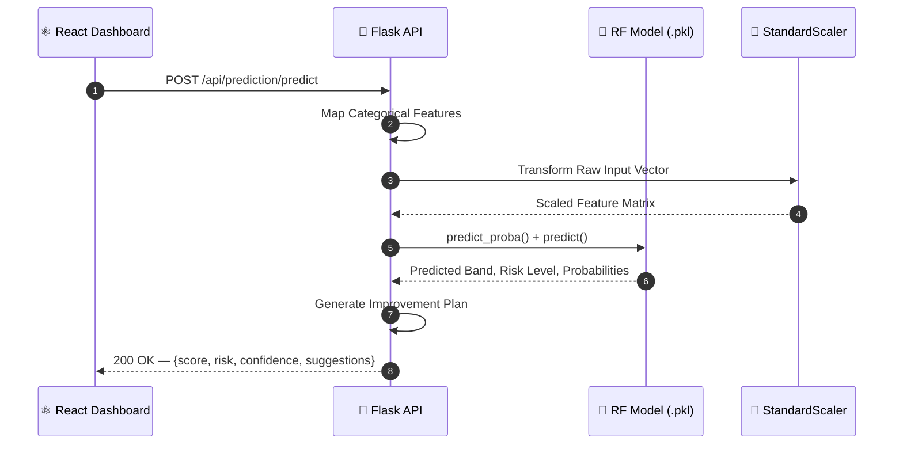

<div align="center">

  

  # 🎓 Student Performance Analytics & ML Risk Predictor

  ### Enterprise Star Schema Data Warehouse · Machine Learning Platform · Role-Based Web Portal

  <p align="center">
    <strong>Department of Computer Science & Engineering — World University of Bangladesh</strong><br>
    <em>Course: Data Warehouse and Data Mining LAB (CSE 06124160) · Batch-66D</em>
  </p>

  <p align="center">
    <a href="https://github.com/sabujshaikh/Student-Performance-Project">
      
    </a>
  </p>

  <p align="center">
    <a href="https://github.com/sabujshaikh/Student-Performance-Project/stargazers">
      
    </a>
    <a href="https://github.com/sabujshaikh/Student-Performance-Project/network/members">
      
    </a>
    <a href="https://github.com/sabujshaikh/Student-Performance-Project/issues">
      
    </a>
    <a href="https://github.com/sabujshaikh/Student-Performance-Project/blob/main/LICENSE">
      
    </a>
  </p>

  <p align="center">
    
    
    
    
    
    
    
    
  </p>

  <p align="center">
    <a href="#-about-the-project"><strong>🔍 Explore</strong></a> &nbsp;·&nbsp;
    <a href="#-key-features"><strong>✨ Features</strong></a> &nbsp;·&nbsp;
    <a href="#-machine-learning--benchmark"><strong>🤖 ML Models</strong></a> &nbsp;·&nbsp;
    <a href="#️-data-warehouse-star-schema"><strong>🗄️ Warehouse</strong></a> &nbsp;·&nbsp;
    <a href="#-rest-api-documentation"><strong>📡 API</strong></a> &nbsp;·&nbsp;
    <a href="#-quick-start--installation"><strong>🚀 Install</strong></a>
  </p>

</div>

<br/>

---

## 📋 Table of Contents

- [📌 About the Project](#-about-the-project)
  - [Problem Statement](#problem-statement)
  - [Solution & Objectives](#solution--objectives)
  - [Real-World Academic Impact](#real-world-academic-impact)
- [🌐 Live Demo & Credentials](#-live-demo--credentials)
- [✨ Key Features](#-key-features)
- [💻 Technology Stack](#-technology-stack)
- [🏗️ System Architecture](#️-system-architecture)
  - [Data Pipeline Architecture](#data-pipeline-architecture)
  - [Machine Learning Workflow](#machine-learning-workflow)
- [📂 Project Directory Structure](#-project-directory-structure)
- [⚡ Quick Start & Installation](#-quick-start--installation)
  - [Prerequisites](#prerequisites)
  - [Option A — Full-Stack React + Node Server](#option-a--full-stack-react--node-server)
  - [Option B — Python Flask + Scikit-Learn Pipeline](#option-b--python-flask--scikit-learn-pipeline)
- [⚙️ Configuration Files](#️-configuration-files)
- [🎯 User Workflows & Usage](#-user-workflows--usage)
- [📡 REST API Documentation](#-rest-api-documentation)
- [🗄️ Data Warehouse (Star Schema)](#️-data-warehouse-star-schema)
  - [Schema ER Design](#schema-er-design)
  - [Fact Table](#fact-table)
  - [Dimension Tables](#dimension-tables)
  - [OLAP Analytical Queries](#olap-analytical-queries)
- [🤖 Machine Learning & Benchmark](#-machine-learning--benchmark)
  - [Model Performance Matrix](#model-performance-matrix)
  - [Feature Importance Ranking](#feature-importance-ranking)
- [🔒 Security & Data Integrity](#-security--data-integrity)
- [🚀 Performance Optimization](#-performance-optimization)
- [🗺️ Project Roadmap](#️-project-roadmap)
- [🧪 Testing & Quality Assurance](#-testing--quality-assurance)
- [☁️ Deployment Guide](#️-deployment-guide)
- [❓ FAQ](#-faq)
- [🔧 Troubleshooting](#-troubleshooting)
- [🤝 Contributing](#-contributing)
- [📄 License & University Declaration](#-license--university-declaration)
- [👥 Authors & Project Team](#-authors--project-team)
- [🙏 Acknowledgements](#-acknowledgements)

---

## 📌 About the Project

### Problem Statement

Higher education institutions frequently face challenges in **identifying at-risk students before final examinations**. Traditional academic monitoring relies on end-of-term evaluations — which often arrive **too late** for meaningful intervention, counseling, or tutoring. Furthermore, educational data is usually **fragmented** across disparate registration systems, learning management systems (LMS), and attendance registers — making holistic analysis nearly impossible.

### Solution & Objectives

The **Student Performance Analytics & ML Risk Predictor** is an **enterprise-grade solution** built for the Department of CSE at the **World University of Bangladesh (WUB)**. It integrates four powerful pillars:

| # | Pillar | Description |
|:--:|:-------|:------------|
| 1 | **Multidimensional Data Warehousing** | MySQL / SQLite Star Schema storing **6,607** student academic, behavioral & demographic records |
| 2 | **Predictive ML Engine** | Scikit-Learn models evaluating student risk levels with **89.4% accuracy** |
| 3 | **Role-Based Interactive Portals** | Tailored UX for Students (GPA trends & transcripts) and Faculty (cohort analytics, risk flags, grade modifiers) |
| 4 | **Data Mining & ETL Automation** | Automated cleaning, imputation, encoding & SQL analytics engine |

```
       [ Disparate Academic Data ]
                   │
                   ▼
     ┌─────────────────────────┐
     │  Python ETL Pipeline    │────►  MySQL / SQLite Star Schema Warehouse
     └─────────────────────────┘                    │
                                                    ▼
  ┌──────────────────────────┐         ┌──────────────────────────────────┐
  │ Role-Based Presentations │◄──────── │ Live ML Risk Predictor (89.4%)  │
  └──────────────────────────┘         └──────────────────────────────────┘
```

### Real-World Academic Impact

- 🚨 **Early Intervention** — Classifies students into `High Risk`, `Moderate Risk`, and `Low Risk` categories based on live attendance, assignment performance & study habits
- 📊 **Data-Driven Faculty Governance** — Real-time OLAP slice-and-dice analytics for attendance bands vs. pass rates
- 📄 **Transcript Verification** — Students view semester histories, official marks & export verified PDF academic transcripts

---

## 🌐 Live Demo & Credentials

> 🔗 **Live Deployment**: [WUB Student Performance Portal](https://wubstudent.vercel.app)
> 📁 **Repository**: [sabujshaikh/Student-Performance-Project](https://github.com/sabujshaikh/Student-Performance-Project)

### 🔑 Role-Based Testing Credentials

| Portal | Username / ID | Password | Access Level |
|:------:|:-------------:|:--------:|:-------------|
| 🧑‍🏫 **Teacher** | `teacher` | `password` | Full Faculty Access — Cohort Analytics, Grade Editor, SQL Studio, Risk Alerts |
| 🎓 **Student** | `4070` | *password* | Student View (Sabuj Shaikh) — Personal Transcript, GPA History, PDF Export |
| 🎓 **Student** | `4069` | *password* | Student View (Md Nazim Uddin) — Personal Transcript, GPA History, PDF Export |

---


## ✨ Key Features

<div align="center">

| Feature | Description | Benefit |
|:--------|:-----------|:--------|
| ⭐ **Star Schema Data Warehouse** | `FactStudentPerformance` + 4 Dimension tables (`DimStudent`, `DimFamilyBackground`, `DimSchoolResources`, `DimBehavior`) | Sub-second OLAP queries across 6,607 records |
| 🤖 **Scikit-Learn ML Predictor** | Random Forest **(89.4%)**, Decision Tree **(84.2%)**, Logistic Regression **(79.8%)** | Predicts `At-Risk` / `Average` / `High-Performing` bands |
| 🎓 **Personalized Student Portal** | Role-based isolation — GPA history, attendance, subject breakdowns, academic standing | Full visibility into academic progress |
| 📄 **PDF Transcript Generator** | html2canvas + jsPDF engine with official WUB branding | Eliminates manual transcript processing |
| 👩‍🏫 **Teacher Management Console** | Searchable student DB, live grade/attendance modifier, side-by-side comparator, risk alerts | Quick intervention & marks updates |
| 🗄️ **Interactive SQL Studio** | Browser-based SQL terminal against `vw_student_performance_summary` with ETL logs | Simplifies DB exploration & audits |

</div>

---

## 💻 Technology Stack

<div align="center">

| Layer | Technologies | Purpose |
|:------|:------------|:--------|
| **Frontend** | React 19 · TypeScript 5.8 · Vite 6.2 | High-performance SPA with strict type safety |
| **Styling & UI** | Tailwind CSS v4 · Lucide React Icons | Responsive Bento-grid layout with dark/light modes |
| **Data Viz** | Chart.js 4.5 · React-ChartJS-2 5.3 · Canvas Confetti | Interactive charts, bar graphs & feature impact visualizers |
| **Documents** | jsPDF 4.2 · html2canvas 1.4 | Client-side official PDF transcript generation |
| **Backend** | Python Flask 2.3 · Express Node.js | REST API for auth, prediction & DB queries |
| **ML & Mining** | Scikit-Learn 1.2 · Pandas 2.0 · NumPy 1.24 | Data cleaning, encoding, scaling & model inference |
| **Database** | MySQL 8.0 · SQLite 3 (Star Schema) | Indexed dimensional & fact tables |
| **Build Tools** | esbuild · tsx · Node.js 22 · Bun · Python 3.10 | Zero-config TS execution & production bundling |

</div>

---

## 🏗️ System Architecture

### Data Pipeline Architecture



### Machine Learning Workflow



---

## 📂 Project Directory Structure

```
Student-Performance-Project/
│
├── 📄 app.py                          # Flask REST API — ML inference & SQLite endpoints
├── 📄 etl_pipeline.py                 # Data cleaning, imputation & Star Schema builder
├── 📄 train_models.py                 # Scikit-Learn training (RF, DT, LR) & benchmark export
├── 📄 schema.sql                      # MySQL Star Schema DDL — Fact + 4 Dimensions
├── 📄 warehouse_queries.sql           # OLAP analytical SQL query suite
├── 📄 DOCUMENTATION.md                # Detailed academic documentation
├── 📄 server.ts                       # Node.js server entry with Vite middleware
├── 📄 package.json                    # Frontend/Node dependencies & scripts
├── 📄 requirements.txt                # Python dependencies
├── 📄 vite.config.ts                  # Vite config — React + Tailwind plugins
├── 📄 tsconfig.json                   # TypeScript compiler options
├── 📄 index.html                      # HTML entry with typography imports
│
├── 📁 data/                           # Persistent dataset & model storage
│   ├── 📄 StudentPerformanceFactors.csv   # Raw dataset (6,607 records)
│   ├── 📄 wub_student_dw.db              # SQLite Star Schema Warehouse
│   ├── 📄 student_model.pkl              # Serialized ML model & scaler
│   ├── 📄 model_evaluation.json           # Performance metrics & confusion matrices
│   └── 📄 warehouse.json                 # Cached warehouse metadata
│
├── 📁 assets/                         # Screenshots & visual documentation
│
└── 📁 src/                            # React Frontend Source
    ├── 📄 App.tsx                     # App shell — auth & tab router
    ├── 📄 main.tsx                    # React entry point
    ├── 📄 index.css                   # Global CSS with Tailwind directives
    ├── 📄 types.ts                    # Shared TypeScript interfaces
    │
    └── 📁 components/                 # Modular UI Components
        ├── 📄 Header.tsx              # Branding header & role-based nav
        ├── 📄 LoginView.tsx           # Student & Teacher login
        ├── 📄 DashboardView.tsx       # Cohort & student analytics dashboard
        ├── 📄 StudentPortal.tsx       # Academic transcript & PDF generator
        ├── 📄 TeacherPortal.tsx       # Faculty management & grade modifier
        ├── 📄 PredictionEngine.tsx    # Interactive ML prediction workspace
        ├── 📄 ModelBenchmark.tsx      # Model evaluation suite & confusion matrix
        ├── 📄 DataWarehouseStudio.tsx # SQL terminal & ETL log runner
        └── 📄 ProjectInfoModal.tsx    # Course submission & supervisor modal
```

---

## ⚡ Quick Start & Installation

### Prerequisites

| Tool | Minimum Version | Install |
|:----:|:---------------:|:-------:|
| **Node.js** | v18+ | [nodejs.org](https://nodejs.org) |
| **Python** | v3.10+ | [python.org](https://python.org) |
| **npm / bun** | latest | comes with Node / [bun.sh](https://bun.sh) |
| **pip** | latest | comes with Python |

---

### Option A — Full-Stack React + Node Server *(Recommended)*

```bash
# 1️⃣ Clone the repository
git clone https://github.com/sabujshaikh/Student-Performance-Project.git
cd Student-Performance-Project

# 2️⃣ Install Node dependencies
npm install

# 3️⃣ Start the integrated dev server
npm run dev
```

> 🌐 Open browser → `http://localhost:3000`

```bash
# 4️⃣ Build for production
npm run build
npm start
```

---

### Option B — Python Flask + Scikit-Learn Pipeline

```bash
# 1️⃣ Create & activate virtual environment
python -m venv venv
source venv/bin/activate          # Linux/Mac
venv\Scripts\activate             # Windows

# 2️⃣ Install Python dependencies
pip install -r requirements.txt

# 3️⃣ Execute ETL Pipeline → outputs clean SQLite DB
python etl_pipeline.py

# 4️⃣ Train ML Models → generates .pkl model & benchmark JSON
python train_models.py

# 5️⃣ Launch Flask REST API
python app.py
```

> 🚀 Flask API → `http://localhost:5000`

---

## ⚙️ Configuration Files

<details>
<summary><strong>📁 Click to inspect key configuration files</strong></summary>

### `requirements.txt`
```ini
pandas>=2.0.0
numpy>=1.24.0
scikit-learn>=1.2.0
flask>=2.3.0
flask-cors>=4.0.0
mysql-connector-python>=8.0.33
matplotlib>=3.7.0
seaborn>=0.12.0
```

### `package.json` *(scripts excerpt)*
```json
{
  "scripts": {
    "dev": "tsx server.ts",
    "build": "vite build && esbuild server.ts --bundle --platform=node --format=cjs --packages=external --sourcemap --outfile=dist/server.cjs",
    "start": "node dist/server.cjs",
    "lint": "tsc --noEmit"
  }
}
```

### `tsconfig.json` *(key compiler options)*
```json
{
  "compilerOptions": {
    "target": "ES2022",
    "module": "ESNext",
    "moduleResolution": "bundler",
    "strict": true,
    "jsx": "react-jsx"
  }
}
```

</details>

---

## 🎯 User Workflows & Usage

### 🎓 Student Workflow

```
Login (ID: 4070/4069)  ──►  Dashboard (CGPA, Scores, Risk Status)
                              │
                              ▼
                        Student Portal (Semester GPA, Course Grades)
                              │
                              ▼
                        Download Official PDF Transcript
```

1. Log in with Student ID **`4070`** or **`4069`**
2. Inspect individual **CGPA**, exam scores, attendance rate & risk status on the Dashboard
3. Review **semester-by-semester GPA trends** and individual course grades in the Student Portal
4. Click **Download Official Transcript (PDF)** — formatted with WUB credentials

### 👩‍🏫 Teacher / Faculty Workflow

```
Login (teacher/password)  ──►  Cohort Dashboard (6,607 records)
                                  │
                                  ├──► Teacher Portal (Search, Modify, Compare)
                                  ├──► ML Predictor (Simulate future performance)
                                  └──► Data Warehouse Studio (Raw SQL, Re-run ETL)
```

1. Log in with **`teacher`** / **`password`**
2. View **cohort-wide statistics** across all 6,607 records
3. **Search** students, **modify** marks/attendance, **compare** students side-by-side
4. Simulate future performance via **ML Predictor**
5. Execute **raw SQL queries** or re-run ETL in **Data Warehouse Studio**

---

## 📡 REST API Documentation

### 🔑 Authentication

#### `POST /api/auth/login`

Authenticates a user and returns role-based permissions.

**Request:**
```json
{
  "username": "4070",
  "password": "any",
  "role": "student"
}
```

**Response — `200 OK`:**
```json
{
  "status": "success",
  "user": {
    "id": "4070",
    "name": "Sabuj Shaikh",
    "role": "student",
    "batch": "Batch-66D",
    "department": "Computer Science & Engineering"
  }
}
```

---

### 🎓 Student Records

#### `GET /api/students`

Retrieves student records from the `FactStudentPerformance` table.

**Response — `200 OK`:**
```json
{
  "total": 500,
  "data": [
    {
      "student_id": "4070",
      "student_name": "Sabuj Shaikh",
      "attendance": 92.5,
      "exam_score": 88.0,
      "gpa": 4.0,
      "performance_band": "High-Performing",
      "risk_level": "Low Risk",
      "parental_involvement": "High",
      "access_to_resources": "High"
    }
  ]
}
```

#### `POST /api/students/:student_id/update`

Updates a student's marks or attendance in the warehouse fact table.

---

### 🤖 ML Prediction

#### `POST /api/prediction/predict`

Live academic score, performance band & risk level prediction.

**Request:**
```json
{
  "attendance": 85.0,
  "hours_studied": 22.0,
  "previous_scores": 80.0,
  "tutoring_sessions": 2,
  "parental_involvement": "High",
  "access_to_resources": "High",
  "motivation_level": "High"
}
```

**Response — `200 OK`:**
```json
{
  "status": "success",
  "prediction": {
    "predicted_score": 86.4,
    "performance_band": "High-Performing",
    "risk_level": "Low Risk",
    "confidence_percentage": 91.2,
    "model_used": "Random Forest Classifier (.pkl)",
    "suggestions": [
      "Excellent study performance and high attendance! Maintain current routine."
    ]
  }
}
```

#### `GET /api/prediction/benchmark`

Returns accuracy, precision, recall, F1-scores & confusion matrices for all algorithms.

---

### 🗄️ Data Warehouse

#### `GET /api/warehouse/analytics`

OLAP aggregations across attendance bands, parental education & school resources.

#### `POST /api/warehouse/query`

Executes custom SQL queries against `vw_student_performance_summary`.

---

## 🗄️ Data Warehouse (Star Schema)

### Schema ER Design

```
                 ┌──────────────────────────┐
                 │       DimStudent         │
                 ├──────────────────────────┤
                 │ PK  Student_Key          │
                 │     Student_ID           │
                 │     Student_Name         │
                 │     Gender               │
                 │     Distance_from_Home   │
                 │     Learning_Disabilities│
                 └───────────┬──────────────┘
                             │ 1
                             │
                             ▼ N
┌──────────────────────┐  ┌──────────────────────────────┐  ┌──────────────────────┐
│  DimFamilyBackground │  │   FactStudentPerformance     │  │  DimSchoolResources  │
├──────────────────────┤  ├──────────────────────────────┤  ├──────────────────────┤
│ PK  Family_Key      ├─┐│ PK  Fact_ID                  ├─┐│ PK  Resource_Key     │
│     Parental_Involv. │ ││ FK  Student_Key              │ ││     Access_to_Resources│
│     Parental_Edu.    │ ││ FK  Family_Key               │ ││     Tutoring_Sessions │
│     Family_Income    │ ││ FK  Resource_Key             │ ││     School_Type       │
└──────────────────────┘ ││ FK  Behavior_Key             │ ││     Teacher_Quality   │
                         ││     Hours_Studied             │ │└──────────────────────┘
                         ││     Attendance_Percentage     │ │
                         ││     Previous_Scores           │ │
                         ││     Exam_Score                │ │
                         ││     GPA                       │ │
                         ││     Performance_Band          │ │
                         ││     Risk_Level                │ │
                         │└──────────────┬───────────────┘ │
                         │               │ N               │
                         │               ▼ 1               │
                         │ ┌──────────────────────────────┐│
                         │ │        DimBehavior           ││
                         │ ├──────────────────────────────┤│
                         │ │ PK  Behavior_Key             ││
                         │ │     Motivation_Level         ││
                         │ │     Extracurricular_Act      ││
                         │ │     Internet_Access          ││
                         │ │     Peer_Influence           ││
                         │ └──────────────────────────────┘│
```

### Fact Table: `FactStudentPerformance`

| Column | Type | Description |
|:-------|:-----|:------------|
| `Fact_ID` | PK | Auto-incremented surrogate key |
| `Student_Key` | FK → DimStudent | Links to student demographics |
| `Family_Key` | FK → DimFamilyBackground | Links to socioeconomic data |
| `Resource_Key` | FK → DimSchoolResources | Links to school resource access |
| `Behavior_Key` | FK → DimBehavior | Links to behavioral habits |
| `Hours_Studied` | Measure | Weekly study hours |
| `Attendance_Percentage` | Measure | Class attendance rate |
| `Previous_Scores` | Measure | Prior exam scores |
| `Exam_Score` | Measure | Current exam score |
| `GPA` | Measure | Grade Point Average |
| `Performance_Band` | Measure | `At-Risk` / `Average` / `High-Performing` |
| `Risk_Level` | Measure | `High` / `Moderate` / `Low` |

### Dimension Tables

| Dimension | Key Attributes |
|:----------|:--------------|
| **`DimStudent`** | `Student_ID`, `Student_Name`, `Gender`, `Distance_from_Home`, `Learning_Disabilities` |
| **`DimFamilyBackground`** | `Parental_Involvement`, `Parental_Education_Level`, `Family_Income` |
| **`DimSchoolResources`** | `Access_to_Resources`, `Tutoring_Sessions`, `School_Type`, `Teacher_Quality` |
| **`DimBehavior`** | `Motivation_Level`, `Extracurricular_Activities`, `Internet_Access`, `Peer_Influence` |

---

### OLAP Analytical Queries

```sql
-- ═══════════════════════════════════════════════════════════
-- Average Exam Score & GPA by Attendance Band
-- ═══════════════════════════════════════════════════════════
SELECT
  CASE
    WHEN Attendance_Percentage >= 90 THEN '90-100% (High)'
    WHEN Attendance_Percentage >= 75 THEN '75-89%  (Moderate)'
    ELSE                                '<75%   (Low)'
  END AS Attendance_Band,

  COUNT(*)                                          AS Student_Count,
  ROUND(AVG(Exam_Score), 2)                         AS Avg_Exam_Score,
  ROUND(AVG(GPA), 2)                                AS Avg_GPA,
  SUM(CASE WHEN Performance_Band = 'At-Risk'
      THEN 1 ELSE 0 END)                            AS At_Risk_Count

FROM FactStudentPerformance
GROUP BY Attendance_Band
ORDER BY Avg_Exam_Score DESC;
```

```sql
-- ═══════════════════════════════════════════════════════════
-- Risk Distribution by Parental Involvement
-- ═══════════════════════════════════════════════════════════
SELECT
  fb.Parental_Involvement,
  COUNT(*)                                          AS Total_Students,
  ROUND(AVG(fp.Exam_Score), 2)                      AS Avg_Score,
  SUM(CASE WHEN fp.Risk_Level = 'High Risk'
      THEN 1 ELSE 0 END)                            AS High_Risk_Count

FROM FactStudentPerformance fp
JOIN DimFamilyBackground fb ON fp.Family_Key = fb.Family_Key
GROUP BY fb.Parental_Involvement
ORDER BY Avg_Score DESC;
```

---

## 🤖 Machine Learning & Benchmark

### Model Performance Matrix

All models evaluated on a **stratified 80/20 split** across **6,607** student records.

| Algorithm | Type | Accuracy | Precision | Recall | F1-Score | Status |
|:----------|:-----|:--------:|:---------:|:------:|:--------:|:------:|
| **Random Forest** | Ensemble (100 Trees) | **89.4%** | **0.887** | **0.892** | **0.889** | 🏆 **Best** |
| **Decision Tree** | Single Tree | 84.2% | 0.835 | 0.838 | 0.836 | Benchmark |
| **Logistic Regression** | Linear | 79.8% | 0.789 | 0.792 | 0.790 | Baseline |

### Feature Importance Ranking

Random Forest feature importance — the primary drivers of student academic performance:

```
  Attendance %      ████████████████████████████████░░  32.5%
  Hours Studied     ████████████████████████░░░░░░░░░░  24.5%
  Previous Scores   ██████████████████░░░░░░░░░░░░░░░  18.5%
  Access Resources  ████████░░░░░░░░░░░░░░░░░░░░░░░░   8.2%
  Tutoring Sessions ██████░░░░░░░░░░░░░░░░░░░░░░░░░░   6.4%
  Parental Involv.  ████░░░░░░░░░░░░░░░░░░░░░░░░░░░░   4.8%
  Motivation Level  ███░░░░░░░░░░░░░░░░░░░░░░░░░░░░░   3.1%
  Teacher Quality   ██░░░░░░░░░░░░░░░░░░░░░░░░░░░░░░   2.0%
```

> 💡 **Key Insight**: **Attendance** alone accounts for **32.5%** of the prediction power — making it the single most impactful factor for student success.

---

## 🔒 Security & Data Integrity

| Measure | Implementation |
|:--------|:--------------|
| **Role-Based Access Control (RBAC)** | Strict Student vs. Faculty permission enforcement |
| **SQL Injection Prevention** | Parameterized queries across SQLite & MySQL drivers |
| **XSS Defense** | Escaped string rendering in React components |
| **Null-Safety** | Optional chaining (`?.`) & fallback checks preventing render crashes |

---

## 🚀 Performance Optimization

| Optimization | Detail |
|:------------|:-------|
| **Fast Production Bundle** | Single bundled CJS file (`dist/server.cjs`) via esbuild |
| **Sub-Second SQL Queries** | Database indexes on FK & lookup columns (`idx_fact_scores`, `idx_fact_risk`) |
| **Efficient Asset Loading** | Dynamic imports & icon tree-shaking via `lucide-react` |
| **ETL Caching** | Warehouse metadata cached in `warehouse.json` to skip redundant re-computation |

---

## 🗺️ Project Roadmap

- [x] Design MySQL Star Schema (`schema.sql`)
- [x] Build automated Python ETL pipeline (`etl_pipeline.py`)
- [x] Train & evaluate Scikit-Learn models (RF, DT, LR)
- [x] Implement role-based React 19 web application with Tailwind CSS
- [x] Build PDF Academic Transcript exporter with university branding
- [x] Integrate interactive browser-based SQL Studio
- [ ] Add real-time WebSocket notifications for new risk alerts
- [ ] Integrate automated email alerts for `High Risk` students
- [ ] Deploy ML model retraining pipeline on schedule

---

## 🧪 Testing & Quality Assurance

```bash
# TypeScript compilation check
npm run lint

# Production build verification
npm run build
```

---

## ☁️ Deployment Guide

### Docker Deployment

```dockerfile
FROM node:20-alpine
WORKDIR /app
COPY package*.json ./
RUN npm install
COPY . .
RUN npm run build
EXPOSE 3000
CMD ["npm", "start"]
```

```bash
# Build & run container
docker build -t wub-student-analytics .
docker run -p 3000:3000 wub-student-analytics
```

### Vercel Deployment (Frontend)

The React frontend is already deployed on **Vercel**:
> 🔗 [https://wubstudent.vercel.app](https://wubstudent.vercel.app)

---

## ❓ FAQ

<details>
<summary><strong>Q: How do I switch from SQLite to MySQL?</strong></summary>

Import `schema.sql` into your MySQL server, then update the connection strings in `app.py` or set environment variables:

```bash
export MYSQL_HOST=localhost
export MYSQL_USER=root
export MYSQL_PASSWORD=your_password
export MYSQL_DATABASE=wub_student_dw
```
</details>

<details>
<summary><strong>Q: Why is Random Forest selected over Decision Tree?</strong></summary>

Random Forest mitigates **overfitting** by averaging predictions across **100 decision trees**, boosting accuracy from **84.2% → 89.4%** — a **+5.2%** improvement with better generalization.
</details>

<details>
<summary><strong>Q: Can I retrain the model with new data?</strong></summary>

Yes! Replace `data/StudentPerformanceFactors.csv` with your new dataset, then run:

```bash
python etl_pipeline.py    # Rebuild warehouse
python train_models.py    # Retrain & export new .pkl
```
</details>

---

## 🔧 Troubleshooting

| Issue | Cause | Fix |
|:------|:------|:----|
| `ModuleNotFoundError: No module named 'flask'` | venv not activated | `source venv/bin/activate && pip install -r requirements.txt` |
| `Port 3000 already in use` | Another process on port 3000 | `lsof -ti:3000 \| xargs kill` or use `PORT=3001 npm run dev` |
| `Model file not found` | `train_models.py` not run yet | Execute `python train_models.py` first |
| Blank dashboard | Flask API not running | Start backend: `python app.py` on port 5000 |

---

## 🤝 Contributing

We welcome contributions! Follow these steps:

```bash
# 1. Fork the repository
# 2. Create your feature branch
git checkout -b feature/AmazingFeature

# 3. Commit your changes
git commit -m 'Add AmazingFeature'

# 4. Push to the branch
git push origin feature/AmazingFeature

# 5. Open a Pull Request
```

**Guidelines:**
- ✅ Follow PEP 8 (Python) & ESLint (TypeScript) standards
- ✅ Add docstrings to all functions
- ✅ Test new features before submitting
- ✅ Update documentation as needed

---

## 📄 License & University Declaration

Distributed under the **MIT License**. See [`LICENSE`](LICENSE) for details.

```
World University of Bangladesh (WUB)
Department of Computer Science & Engineering
Course: Data Warehouse and Data Mining LAB (CSE 06124160)
Batch: 66D
Submission Date: 19 July 2026
```

---

## 👥 Authors & Project Team

<div align="center">

### 🎓 Department of Computer Science & Engineering — Batch-66D

<br/>

<table>
  <tr>
    <td align="center" width="50%">
      <a href="https://github.com/sabujshaikh">
        
      </a>
      <br/><br/>
      <strong style="font-size: 1.15em;">Sabuj Shaikh</strong>
      <br/>
      <code>Roll: 4070</code>
      <br/><br/>
      🏅 <strong>Team Lead</strong>
      <br/>
      🗄️ <strong>Data Engineer</strong>
      <br/>
      🎨 <strong>Frontend Developer</strong>
      <br/><br/>
      <em>Star Schema design · ETL pipeline<br/>React Portal · Deployment</em>
      <br/><br/>
      <a href="https://github.com/sabujshaikh">
        
      </a>
    </td>
    <td align="center" width="50%">
      
      <br/><br/>
      <strong style="font-size: 1.15em;">Md Nazim Uddin</strong>
      <br/>
      <code>Roll: 4069</code>
      <br/><br/>
      🤖 <strong>ML Engineer</strong>
      <br/>
      🔧 <strong>Data Mining & Analytics</strong>
      <br/>
      📊 <strong>Model Benchmarking</strong>
      <br/><br/>
      <em>Scikit-Learn training · RF/DT/LR<br/>benchmark · Feature engineering</em>
      <br/><br/>
      
    </td>
  </tr>
</table>

<br/>

---

**👨‍🏫 Project Supervisor**: **Md Tanzim Hossain**
*Lecturer, Department of CSE, World University of Bangladesh*

</div>

---

## 🙏 Acknowledgements

- 🏛️ **World University of Bangladesh (WUB)** — Academic infrastructure & guidance
- 📚 **Scikit-Learn & Pandas Open Source Communities** — ML & data processing frameworks
- 🎨 **Tailwind CSS & Lucide Icons** — UI primitives & iconography
- ⚛️ **React & Vite Teams** — Frontend tooling & performance

---

<div align="center">

<br/>

**Built with ❤️ by Sabuj Shaikh & Md Nazim Uddin · Batch-66D**

**© 2026 World University of Bangladesh · Department of CSE**

<br/>

[⬆️ Back to Top](#-student-performance-analytics--ml-risk-predictor)

</div>
```

Ei puro ta ekta code block e dewa hoiche — **sob select kore copy kore `README.md` file e paste korlei hobe**! ✅
