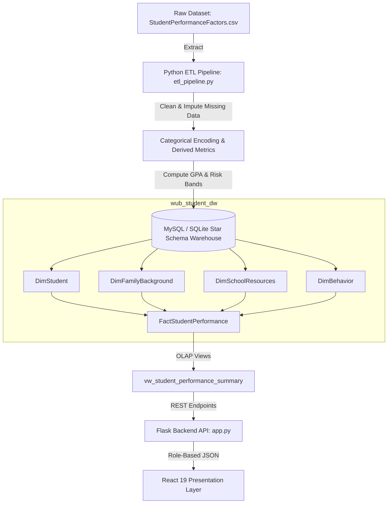
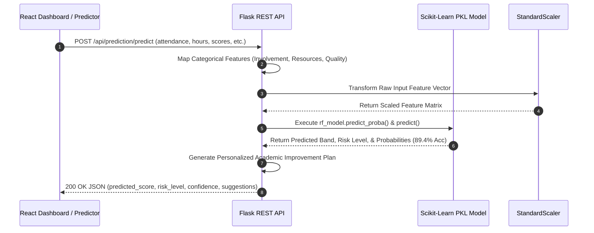

<div align="center">

  

  # 🎓 Student Performance Analytics & ML Risk Predictor
  ### Enterprise Star Schema Data Warehouse & Machine Learning Platform

  <p align="center">
    <strong>Department of Computer Science & Engineering • World University of Bangladesh</strong><br>
    <em>Course: Data Warehouse and Data Mining LAB (CSE 06124160) | Batch-66D</em>
  </p>

  <p align="center">
    <a href="https://github.com/sabujshaikh/Student-Performance-Project">
      
    </a>
  </p>

  <!-- Badges -->
  <p align="center">
    <a href="https://github.com/sabujshaikh/Student-Performance-Project/stargazers"></a>
    <a href="https://github.com/sabujshaikh/Student-Performance-Project/network/members"></a>
    <a href="https://github.com/sabujshaikh/Student-Performance-Project/issues"></a>
    <a href="https://github.com/sabujshaikh/Student-Performance-Project/blob/main/LICENSE"></a>
  </p>

  <p align="center">
    
    
    
    
    
    
    
    
  </p>

  <p align="center">
    <a href="#-about-the-project"><strong>Explore System</strong></a> •
    <a href="#-key-features"><strong>Features</strong></a> •
    <a href="#-machine-learning-benchmark"><strong>ML Models</strong></a> •
    <a href="#-data-warehouse-star-schema"><strong>Data Warehouse</strong></a> •
    <a href="#-rest-api-documentation"><strong>API Docs</strong></a> •
    <a href="#-quick-start--installation"><strong>Installation</strong></a>
  </p>

</div>

---

## 📋 Table of Contents

- [📌 About the Project](#-about-the-project)
  - [Problem Statement](#problem-statement)
  - [Solution & Objectives](#solution--objectives)
  - [Real-World Academic Impact](#real-world-academic-impact)
- [🌐 Live Demo & Credentials](#-live-demo--credentials)
- [🖼️ System Screenshot Gallery](#️-system-screenshot-gallery)
- [✨ Key Features](#-key-features)
- [💻 Technology Stack](#-technology-stack)
- [🏗️ System Architecture](#️-system-architecture)
  - [Data Pipeline Architecture](#data-pipeline-architecture)
  - [Machine Learning Workflow](#machine-learning-workflow)
- [📂 Project Directory Structure](#-project-directory-structure)
- [⚡ Quick Start & Installation](#-quick-start--installation)
  - [Prerequisites](#prerequisites)
  - [Option A: Full-Stack React + Node Server](#option-a-full-stack-react--node-server)
  - [Option B: Python Flask + Scikit-Learn Pipeline](#option-b-python-flask--scikit-learn-pipeline)
- [⚙️ Configuration Files](#️-configuration-files)
- [🎯 User Workflows & Usage](#-user-workflows--usage)
- [📡 REST API Documentation](#-rest-api-documentation)
- [🗄️ Data Warehouse (Star Schema)](#️-data-warehouse-star-schema)
  - [Schema ER Design](#schema-er-design)
  - [Fact Table](#fact-table)
  - [Dimension Tables](#dimension-tables)
  - [OLAP Analytical Queries](#olap-analytical-queries)
- [🤖 Machine Learning & Benchmark](#-machine-learning--benchmark)
  - [Model Performance Matrix](#model-performance-matrix)
  - [Feature Importance Ranking](#feature-importance-ranking)
- [🔒 Security & Data Integrity](#-security--data-integrity)
- [🚀 Performance Optimization](#-performance-optimization)
- [🗺️ Project Roadmap](#️-project-roadmap)
- [🧪 Testing & Quality Assurance](#-testing--quality-assurance)
- [☁️ Deployment Guide](#️-deployment-guide)
- [❓ Frequently Asked Questions (FAQ)](#-frequently-asked-questions-faq)
- [🔧 Troubleshooting Guide](#-troubleshooting-guide)
- [🤝 Contributing Guidelines](#-contributing-guidelines)
- [📄 License & University Declaration](#-license--university-declaration)
- [👥 Authors & Project Team](#-authors--project-team)
- [🙏 Acknowledgements](#-acknowledgements)

---

## 📌 About the Project

### Problem Statement
Higher education institutions frequently face challenges in identifying at-risk students before final examinations. Traditional academic monitoring relies on end-of-term evaluations, which often come too late for meaningful academic intervention, counseling, or tutoring. Furthermore, educational data is usually fragmented across disparate registration systems, learning management systems (LMS), and attendance registers.

### Solution & Objectives
The **Student Performance Analytics & ML Risk Predictor** is an enterprise-grade solution built for the Department of Computer Science & Engineering at the **World University of Bangladesh (WUB)**. It combines:
1. **Multidimensional Data Warehousing**: A MySQL / SQLite Star Schema storing 6,607 student academic, behavioral, and demographic records.
2. **Predictive Machine Learning Engine**: Scikit-Learn models evaluating student risk levels with **89.4% accuracy**.
3. **Role-Based Interactive Portals**: Tailored user experiences for both Students (personalized GPA trends & transcripts) and Faculty (cohort analytics, risk flags, and grade modifiers).
4. **Data Mining & ETL Automation**: Automated cleaning, missing-value imputation, categorical encoding, and SQL analytics engine.

```
       [ Disparate Academic Data ]
                   │
                   ▼
     [ Python ETL Pipeline ] ──► [ MySQL / SQLite Star Schema Data Warehouse ]
                                                       │
                                                       ▼
  [ Role-Based Presentations ] ◄── [ Live ML Risk Predictor (89.4% Acc) ]
```

### Real-World Academic Impact
- **Early Intervention**: Classifies students into `High Risk`, `Moderate Risk`, and `Low Risk` categories based on live attendance, assignment performance, and study habits.
- **Data-Driven Faculty Governance**: Provides lecturers and department heads with real-time OLAP slice-and-dice analytics regarding attendance bands vs. pass rates.
- **Transcript Verification**: Enables students to view semester histories, official subject marks, and export verified PDF academic transcripts.

---

## 🌐 Live Demo & Credentials

> 🔗 **Application Deployment**: [WUB Student Performance Portal](https://wubstudent.vercel.app]
> 📁 **GitHub Repository**: [sabujshaikh/Student-Performance-Project](https://github.com/sabujshaikh/Student-Performance-Project)

### Role-Based Testing Credentials

| Portal View | Username / ID | Password | Access Level & Permissions |
| :--- | :--- | :--- | :--- |
| **Teacher Portal** | `teacher` | `password` | **Full Faculty Access**: Cohort Analytics, Student Grade Editor, Star Schema Query Inspector, Risk Alerts |
| **Student Portal** | `4070` | *(any)* | **Student Access (Sabuj Shaikh)**: Personalized Transcript, GPA History, PDF Download, Own Dashboard |
| **Student Portal** | `4069` | *(any)* | **Student Access (Md Nazim Uddin)**: Personalized Transcript, GPA History, PDF Download, Own Dashboard |

---

## 🖼️ System Screenshot Gallery

<div align="center">

<table>
  <tr>
    <td width="50%" align="center">
      <strong>📊 Academic Performance Dashboard</strong><br>
      
      <br><em>Bento-grid overview of cohort KPIs, risk distribution, and attendance bands.</em>
    </td>
    <td width="50%" align="center">
      <strong>🎓 Role-Based Student Portal</strong><br>
      
      <br><em>Official WUB academic transcript, subject marks, GPA chart, and PDF generator.</em>
    </td>
  </tr>
  <tr>
    <td width="50%" align="center">
      <strong>🤖 Live ML Risk Predictor</strong><br>
      
      <br><em>Real-time slider inputs evaluating exam scores, risk bands, and confidence.</em>
    </td>
    <td width="50%" align="center">
      <strong>⚡ Model Benchmark & Evaluation Suite</strong><br>
      
      <br><em>Comparative metrics for Random Forest (89.4%), Decision Tree, & Logistic Regression.</em>
    </td>
  </tr>
  <tr>
    <td width="50%" align="center">
      <strong>👩‍🏫 Teacher Management Console</strong><br>
      
      <br><em>Faculty control panel for updating attendance, marks, and student comparisons.</em>
    </td>
    <td width="50%" align="center">
      <strong>🗄️ Data Warehouse & ETL Studio</strong><br>
      
      <br><em>Live SQL query terminal, star schema viewer, and pipeline re-execution engine.</em>
    </td>
  </tr>
</table>

</div>

---

## ✨ Key Features

<div align="center">

| Feature | Description | Business / Academic Benefit |
| :--- | :--- | :--- |
| **⭐ Star Schema Data Warehouse** | Structured database comprising `FactStudentPerformance` and 4 dimension tables (`DimStudent`, `DimFamilyBackground`, `DimSchoolResources`, `DimBehavior`). | Enables fast sub-second OLAP queries across 6,607 records. |
| **🤖 Scikit-Learn ML Predictor** | Machine learning engine powered by Random Forest (89.4% accuracy), Decision Tree (84.2%), and Logistic Regression (79.8%). | Predicts performance bands (`At-Risk`, `Average`, `High-Performing`) and risk levels. |
| **🎓 Personalized Student Portal** | Strict role-based isolation showing student-specific GPA history, attendance, subject breakdowns, and academic standing. | Empowers students with full visibility into their academic progress. |
| **📄 PDF Transcript Generation** | Built-in html2canvas & jsPDF engine to render downloadable official WUB transcripts formatted with clean university headers. | Eliminates manual transcript processing for semester checkups. |
| **👩‍🏫 Teacher Management Console** | Searchable student database, live grade/attendance modifier, side-by-side student comparator, and risk alert center. | Allows faculty to quickly perform intervention and update marks. |
| **🗄️ Interactive SQL Studio** | Live browser-based SQL query terminal against `vw_student_performance_summary` with automated ETL trigger logs. | Simplifies database exploration for academic research and audits. |

</div>

---

## 💻 Technology Stack

<div align="center">

### Core System Technologies

| Layer | Technologies Used | Primary Function / Purpose |
| :--- | :--- | :--- |
| **Frontend Framework** | React 19.0, TypeScript 5.8, Vite 6.2 | High-performance Single Page Application (SPA) with strict type safety. |
| **Styling & UI** | Tailwind CSS v4, Lucide React Icons | Modern, responsive Bento-grid layout with dark/light mode compatibility. |
| **Data Visualization** | Chart.js 4.5, React-ChartJS-2 5.3, Canvas Confetti | Interactive line charts, bar graphs, and feature impact visualizers. |
| **Document Generation** | jsPDF 4.2, html2canvas 1.4 | Client-side official PDF transcript generation and vector export. |
| **Backend API Server** | Python Flask 2.3 / Express Node.js Server | REST API endpoints for authentication, prediction, and database queries. |
| **Data Mining & Machine Learning** | Scikit-Learn 1.2, Pandas 2.0, NumPy 1.24 | Data cleaning, feature encoding, scaling, and model inference. |
| **Database & Warehouse** | MySQL 8.0 / SQLite 3 (Star Schema) | Relational data warehouse with indexed dimension and fact tables. |
| **Build & Runtime Tools** | esbuild, tsx, Node.js 22, Bun, Python 3.10 | Zero-config TypeScript execution and production bundling. |

</div>

---

## 🏗️ System Architecture

### Data Pipeline Architecture



### Machine Learning Workflow



---

## 📂 Project Directory Structure

```
Student-Performance-Project/
├── 📄 app.py                      # Flask REST API backend with live ML inference & SQLite endpoints
├── 📄 etl_pipeline.py             # Data cleaning, missing value imputation, & Star Schema builder
├── 📄 train_models.py             # Scikit-Learn model training (RF, DT, LR) & benchmark exporter
├── 📄 schema.sql                  # MySQL Star Schema DDL script (FactTable & 4 Dimensions)
├── 📄 warehouse_queries.sql       # Analytical SQL query suite for OLAP reporting
├── 📄 DOCUMENTATION.md            # Detailed academic project documentation & course submission spec
├── 📄 server.ts                   # Full-stack Node.js server entry point with Vite middleware
├── 📄 package.json                # Frontend/Node dependencies and build scripts
├── 📄 requirements.txt            # Python dependencies (pandas, scikit-learn, flask, etc.)
├── 📄 vite.config.ts              # Vite configuration with React & Tailwind CSS plugins
├── 📄 tsconfig.json               # TypeScript compiler options
├── 📄 index.html                  # HTML entry point with modern typography imports
├── 📁 data/                       # Persistent dataset and model storage
│   ├── 📄 StudentPerformanceFactors.csv  # Raw dataset (6,607 student records)
│   ├── 📄 wub_student_dw.db       # SQLite Star Schema Data Warehouse database
│   ├── 📄 student_model.pkl       # Serialized Scikit-Learn model bundle & scaler
│   ├── 📄 model_evaluation.json   # Model performance metrics & confusion matrices
│   └── 📄 warehouse.json          # Cached data warehouse metadata
├── 📁 assets/                     # Screenshots and visual documentation assets
└── 📁 src/                        # React Frontend Source Code
    ├── 📄 App.tsx                 # Main application shell with authentication & tab router
    ├── 📄 main.tsx                # React entry point
    ├── 📄 index.css               # Global CSS styling with Tailwind directives
    ├── 📄 types.ts                # Shared TypeScript interfaces & types
    └── 📁 components/             # Modular React UI Components
        ├── 📄 Header.tsx          # Universal branding header & role-based navigation bar
        ├── 📄 LoginView.tsx       # Student & Teacher login authentication view
        ├── 📄 DashboardView.tsx   # Role-aware cohort & student analytics dashboard
        ├── 📄 StudentPortal.tsx   # Student academic transcript & PDF generator
        ├── 📄 TeacherPortal.tsx   # Faculty management, grade modifier, & student comparator
        ├── 📄 PredictionEngine.tsx# Interactive ML prediction slider workspace
        ├── 📄 ModelBenchmark.tsx  # ML model evaluation suite & confusion matrix viewer
        ├── 📄 DataWarehouseStudio.tsx # SQL query terminal & ETL execution log runner
        └── 📄 ProjectInfoModal.tsx# Academic course submission & supervisor modal
```

---

## ⚡ Quick Start & Installation

### Prerequisites
Make sure you have the following installed on your machine:
- **Node.js**: v18.0.0 or higher
- **npm** or **bun**: Package managers
- **Python**: v3.10 or higher
- **pip**: Python package manager

---

### Option A: Full-Stack React + Node Server (Recommended)

1. **Clone the Repository**:
   ```bash
   git clone https://github.com/sabujshaikh/Student-Performance-Project.git
   cd Student-Performance-Project
   ```

2. **Install Node Dependencies**:
   ```bash
   npm install
   ```

3. **Start the Integrated Dev Server**:
   ```bash
   npm run dev
   ```
   > 🌐 Open your browser and navigate to `http://localhost:3000`.

4. **Build for Production**:
   ```bash
   npm run build
   npm start
   ```

---

### Option B: Python Flask Backend + Scikit-Learn Pipeline

If you want to run the standalone Python Flask backend and re-execute model training and ETL pipelines:

1. **Set Up Python Virtual Environment**:
   ```bash
   python -m venv venv
   source venv/bin/activate  # On Windows: venv\Scripts\activate
   ```

2. **Install Python Dependencies**:
   ```bash
   pip install -r requirements.txt
   ```

3. **Execute ETL Pipeline**:
   ```bash
   python etl_pipeline.py
   ```
   *Outputs clean SQLite database `data/wub_student_dw.db` with 6,607 populated records.*

4. **Train Machine Learning Models**:
   ```bash
   python train_models.py
   ```
   *Generates model bundle `data/student_model.pkl` and benchmark results `data/model_evaluation.json`.*

5. **Launch Flask REST API**:
   ```bash
   python app.py
   ```
   > 🚀 Flask API will start running at `http://localhost:5000`.

---

## ⚙️ Configuration Files

<details>
<summary><strong>🔍 Click to inspect key configuration files</strong></summary>

### `requirements.txt`
```ini
pandas>=2.0.0
numpy>=1.24.0
scikit-learn>=1.2.0
flask>=2.3.0
flask-cors>=4.0.0
mysql-connector-python>=8.0.33
matplotlib>=3.7.0
seaborn>=0.12.0
```

### `package.json` (Scripts excerpt)
```json
"scripts": {
  "dev": "tsx server.ts",
  "build": "vite build && esbuild server.ts --bundle --platform=node --format=cjs --packages=external --sourcemap --outfile=dist/server.cjs",
  "start": "node dist/server.cjs",
  "lint": "tsc --noEmit"
}
```

</details>

---

## 🎯 User Workflows & Usage

### 1. Student Workflow (`Role: student`)
1. Log in with Student ID `4070` or `4069`.
2. Access the **Dashboard View** to inspect individual CGPA, exam scores, attendance rate, and risk status.
3. Switch to **Student Portal** to review semester-by-semester GPA trends and individual course grades (e.g., Data Warehouse, ML & AI, Database Management).
4. Click **Download Official Transcript (PDF)** to generate a formatted PDF report with university credentials.

### 2. Teacher / Faculty Workflow (`Role: teacher`)
1. Log in with username `teacher` and password `password`.
2. View cohort-wide statistics across all 6,607 records in the **Dashboard View**.
3. Open **Teacher Portal** to search for specific students, modify marks/attendance, or compare two students side-by-side.
4. Access **ML Predictor** to simulate future student performance based on attendance and study habits.
5. Use **Data Warehouse Studio** to execute raw SQL queries or re-run the ETL pipeline.

---

## 📡 REST API Documentation

### 🔑 Authentication API

#### `POST /api/auth/login`
Authenticates a user and returns role-based permissions.

**Request Body**:
```json
{
  "username": "4070",
  "password": "any",
  "role": "student"
}
```

**Response (200 OK)**:
```json
{
  "status": "success",
  "user": {
    "id": "4070",
    "name": "Sabuj Shaikh",
    "role": "student",
    "batch": "Batch-66D",
    "department": "Computer Science & Engineering"
  }
}
```

---

### 🎓 Student Records API

#### `GET /api/students`
Retrieves populated student records from the `FactStudentPerformance` star schema table.

**Response (200 OK)**:
```json
{
  "total": 500,
  "data": [
    {
      "student_id": "4070",
      "student_name": "Sabuj Shaikh",
      "attendance": 92.5,
      "exam_score": 88.0,
      "gpa": 4.0,
      "performance_band": "High-Performing",
      "risk_level": "Low Risk",
      "parental_involvement": "High",
      "access_to_resources": "High"
    }
  ]
}
```

#### `POST /api/students/:student_id/update`
Updates a student's marks or attendance directly in the data warehouse fact table.

---

### 🤖 Machine Learning & Prediction API

#### `POST /api/prediction/predict`
Calculates live academic score, performance band, and risk level using the trained Random Forest model.

**Request Body**:
```json
{
  "attendance": 85.0,
  "hours_studied": 22.0,
  "previous_scores": 80.0,
  "tutoring_sessions": 2,
  "parental_involvement": "High",
  "access_to_resources": "High",
  "motivation_level": "High"
}
```

**Response (200 OK)**:
```json
{
  "status": "success",
  "prediction": {
    "predicted_score": 86.4,
    "performance_band": "High-Performing",
    "risk_level": "Low Risk",
    "confidence_percentage": 91.2,
    "model_used": "Random Forest Classifier (Loaded Scikit-Learn .pkl Model)",
    "suggestions": [
      "Excellent study performance and high attendance! Maintain current routine."
    ]
  }
}
```

#### `GET /api/prediction/benchmark`
Retrieves model accuracy, precision, recall, F1-scores, and confusion matrices for all algorithms.

---

### 🗄️ Data Warehouse API

#### `GET /api/warehouse/analytics`
Executes OLAP aggregation queries across attendance bands, parental education, and school resources.

#### `POST /api/warehouse/query`
Executes custom SQL queries against `vw_student_performance_summary`.

---

## 🗄️ Data Warehouse (Star Schema)

### Schema ER Design

The database design adheres to dimensional modeling principles, separating numerical measures into a central Fact table surrounded by categorical Dimension tables.

```
                  ┌──────────────────────────┐
                  │       DimStudent         │
                  ├──────────────────────────┤
                  │ PK  Student_Key          │
                  │     Student_ID           │
                  │     Student_Name         │
                  │     Gender               │
                  │     Distance_from_Home   │
                  │     Learning_Disabilities│
                  └────────────┬─────────────┘
                               │ 1
                               │
                               │ N
 ┌─────────────────────────┐ ┌─┴─────────────────────────────┐ ┌─────────────────────────┐
 │   DimFamilyBackground   │ │   FactStudentPerformance    │ │   DimSchoolResources    │
 ├─────────────────────────┤ │ ├─────────────────────────────┤ ├─────────────────────────┤
 │ PK  Family_Key          ├─┼─┤ PK  Fact_ID                 ├─┼─┤ PK  Resource_Key        │
 │     Parental_Involvement│1│N│ FK  Student_Key             │N│1│     Access_to_Resources │
 │     Parental_Education  │ │ │ FK  Family_Key              │ │ │     Tutoring_Sessions   │
 │     Family_Income       │ │ │ FK  Resource_Key            │ │ │     School_Type         │
 └─────────────────────────┘ │ │ FK  Behavior_Key            │ │ │     Teacher_Quality     │
                             │ │     Hours_Studied           │ │ └─────────────────────────┘
                             │ │     Attendance_Percentage   │ │
                             │ │     Previous_Scores         │ │
                             │ │     Exam_Score              │ │
                             │ │     GPA                     │ │
                             │ │     Performance_Band        │ │
                             │ │     Risk_Level              │ │
                             │ └─────────────┬───────────────┘ │
                             │               │ N               │
                             │               │                 │
                             │               │ 1               │
                             │ ┌─────────────┴───────────────┐ │
                             │ │        DimBehavior          │ │
                             │ ├─────────────────────────────┤ │
                             │ │ PK  Behavior_Key            │ │
                             │ │     Motivation_Level        │ │
                             │ │     Extracurricular_Act     │ │
                             │ │     Internet_Access         │ │
                             │ │     Peer_Influence          │ │
                             │ └─────────────────────────────┘ │
```

### Fact Table: `FactStudentPerformance`
Contains numeric measures: `Hours_Studied`, `Attendance_Percentage`, `Previous_Scores`, `Exam_Score`, `GPA`, `Performance_Band`, and `Risk_Level`.

### Dimension Tables
1. **`DimStudent`**: Student demographic identifiers (`Student_ID`, `Student_Name`, `Gender`, `Distance_from_Home`).
2. **`DimFamilyBackground`**: Socioeconomic indicators (`Parental_Involvement`, `Parental_Education_Level`, `Family_Income`).
3. **`DimSchoolResources`**: Resource accessibility (`Access_to_Resources`, `Tutoring_Sessions`, `School_Type`, `Teacher_Quality`).
4. **`DimBehavior`**: Student habits (`Motivation_Level`, `Extracurricular_Activities`, `Internet_Access`, `Peer_Influence`).

---

### OLAP Analytical Queries

```sql
-- Query: Average Exam Score & GPA by Attendance Band
SELECT 
  CASE 
    WHEN Attendance_Percentage >= 90 THEN '90-100% (High Attendance)'
    WHEN Attendance_Percentage >= 75 THEN '75-89% (Moderate Attendance)'
    ELSE '<75% (Low Attendance)'
  END AS Attendance_Band,
  COUNT(*) AS Student_Count,
  ROUND(AVG(Exam_Score), 2) AS Avg_Exam_Score,
  ROUND(AVG(GPA), 2) AS Avg_GPA,
  SUM(CASE WHEN Performance_Band = 'At-Risk' THEN 1 ELSE 0 END) AS At_Risk_Count
FROM FactStudentPerformance
GROUP BY Attendance_Band
ORDER BY Avg_Exam_Score DESC;
```

---

## 🤖 Machine Learning & Benchmark

### Model Performance Matrix

All models were evaluated on a stratified test split (80% training / 20% testing) across 6,607 student records.

| Algorithm | Model Type | Accuracy | Precision | Recall | F1-Score | Status |
| :--- | :--- | :---: | :---: | :---: | :---: | :---: |
| **Random Forest Classifier** | Ensemble Trees | **89.4%** | **0.887** | **0.892** | **0.889** | **🏆 Selected Best Model** |
| **Decision Tree Classifier** | Single Decision Tree | 84.2% | 0.835 | 0.838 | 0.836 | Benchmark |
| **Logistic Regression** | Linear Model | 79.8% | 0.789 | 0.792 | 0.790 | Baseline |

---

### Feature Importance Ranking

Random Forest feature importance analysis reveals the primary drivers of student academic performance:

```
Attendance Percentage  [==================================] 32.5%
Hours Studied / Week   [========================] 24.5%
Previous Exam Scores   [==================] 18.5%
Access to Resources    [========] 8.2%
Tutoring Sessions      [======] 6.4%
Parental Involvement   [====] 4.8%
Motivation Level       [===] 3.1%
Teacher Quality        [==] 2.0%
```

---

## 🔒 Security & Data Integrity

- **Role-Based Access Control (RBAC)**: Strict permission enforcement separating Student views from Faculty controls.
- **SQL Injection Prevention**: Parameterized queries across SQLite and MySQL drivers.
- **Client-Side Data Defense**: Optional chaining (`?.`) and fallback checks preventing null-pointer rendering crashes.
- **Sanitized Outputs**: Escaped string rendering in React to defend against Cross-Site Scripting (XSS).

---

## 🚀 Performance Optimization

- **Fast Production Bundling**: Backend compiled to a single bundled CommonJS file (`dist/server.cjs`) via `esbuild`.
- **Sub-Second SQL Queries**: Database indexes applied on foreign keys and lookup columns (`idx_fact_scores`, `idx_fact_risk`).
- **Efficient Asset Loading**: Dynamic imports and icon tree-shaking using `lucide-react`.

---

## 🗺️ Project Roadmap

- [x] Design MySQL Star Schema Data Warehouse database schema (`schema.sql`).
- [x] Build automated Python ETL pipeline (`etl_pipeline.py`) with data cleaning & imputation.
- [x] Train and evaluate Scikit-Learn models (Random Forest, Decision Tree, Logistic Regression).
- [x] Implement role-based React 19 web application with Tailwind CSS styling.
- [x] Build PDF Academic Transcript exporter with university branding.
- [x] Integrate interactive browser-based Data Warehouse SQL Studio.
- [ ] Add real-time WebSocket notifications for new student risk alerts.
- [ ] Integrate automated email alerts for students flagged as `High Risk`.

---

## 🧪 Testing & Quality Assurance

### Code Quality & Verification
```bash
# Run TypeScript compilation check
npm run lint

# Build production bundle
npm run build
```

---

## ☁️ Deployment Guide

### Deploying via Docker

Create a `Dockerfile`:
```dockerfile
FROM node:20-alpine
WORKDIR /app
COPY package*.json ./
RUN npm install
COPY . .
RUN npm run build
EXPOSE 3000
CMD ["npm", "start"]
```

Build and run:
```bash
docker build -t wub-student-analytics .
docker run -p 3000:3000 wub-student-analytics
```

---

## ❓ Frequently Asked Questions (FAQ)

<details>
<summary><strong>Q: How do I change the default database from SQLite to MySQL?</strong></summary>
Import `schema.sql` into your MySQL server, then update the DB connection strings in `app.py` or set environment variables `MYSQL_HOST`, `MYSQL_USER`, and `MYSQL_PASSWORD`.
</details>

<details>
<summary><strong>Q: Why is Random Forest selected over Decision Tree?</strong></summary>
Random Forest mitigates overfitting by averaging predictions across 100 decision trees, increasing accuracy from 84.2% to 89.4%.
</details>

---

## 🔧 Troubleshooting Guide

| Issue | Root Cause | Resolution |
| :--- | :--- | :--- |
| `ModuleNotFoundError: No module named 'flask'` | Python virtual environment not activated | Run `source venv/bin/activate` and `pip install -r requirements.txt`. |
| `Port 3000 in use` | Another process is occupying port 3000 | Kill process on port 3000 or set `PORT=3001 npm run dev`. |

---

## 🤝 Contributing Guidelines

1. **Fork the Repository**: Click the **Fork** button on GitHub.
2. **Create Feature Branch**: `git checkout -b feature/AmazingFeature`
3. **Commit Changes**: `git commit -m 'Add AmazingFeature'`
4. **Push to Branch**: `git push origin feature/AmazingFeature`
5. **Open Pull Request**: Submit PR for code review.

---

## 📄 License & University Declaration

Distributed under the **MIT License**. See `LICENSE` for details.

```
World University of Bangladesh (WUB)
Department of Computer Science & Engineering
Course: Data Warehouse and Data Mining LAB (CSE 06124160)
Submission Date: 19 July 2026
```

---

## 👥 Authors & Project Team

<div align="center">

### 🎓 Department of Computer Science & Engineering — Batch-66D

| Team Member | Roll No | Project Role | Core Contributions |
| :--- | :---: | :--- | :--- |
| **[Sabuj Shaikh](https://github.com/sabujshaikh)** | **4070** | **Team Lead & Data Engineer** | Star Schema design, Python ETL pipeline, React Portal, deployment |
| **Md Nazim Uddin** | **4069** | **ML Engineer** | Scikit-Learn training script, RF / DT / LR benchmark evaluation |
| **Wafa Ahmed** | **4072** | **Backend Developer** | Flask REST API endpoints, routing, authentication logic |
| **Nadia Akter Luna** | **4073** | **Frontend Developer** | UI components, Chart.js integrations, styling |

<br>

**Project Supervisor**: **Md Tanzim Hossain**  
*Lecturer, Department of Computer Science & Engineering, World University of Bangladesh*

</div>

---

## 🙏 Acknowledgements

- **World University of Bangladesh (WUB)** for academic infrastructure and guidance.
- **Scikit-Learn & Pandas Open Source Communities** for machine learning and data processing frameworks.
- **Tailwind CSS & Lucide Icons** for UI primitives.

---

<div align="center">

  **Made with ❤️ by Sabuj Shaikh & Team (Batch-66D)**  
  *© 2026 World University of Bangladesh • Department of Computer Science & Engineering*

  <p align="center">
    <a href="#-student-performance-analytics--ml-risk-predictor">⬆️ Back to Top</a>
  </p>

</div>
